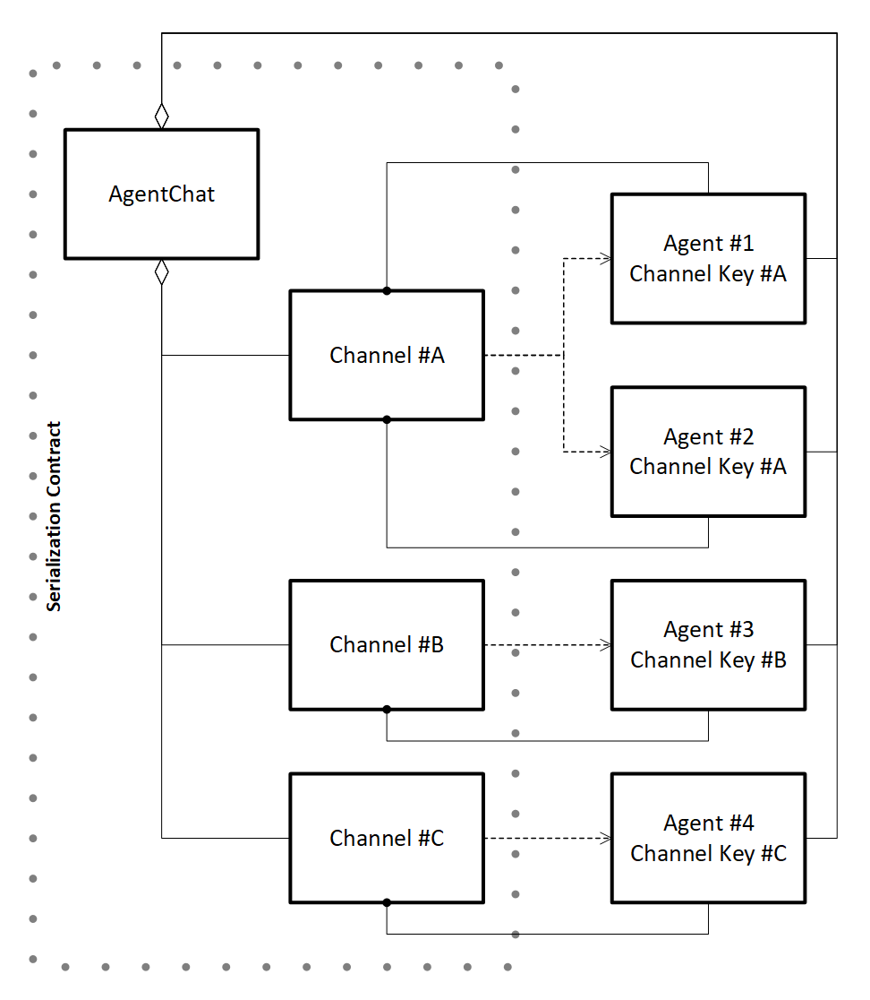

# `AgentChat` Serialization / Deserialization

## Context and Problem Statement
Users of the _Agent Framework_ are unable to store and later retrieve conversation state when using an `AgentChat` to coordinate `Agent` interactions.  This limits the ability for an agent conversation to single use as it must be maintained with memory of the process that initiated the conversation.

Formalizing a mechanism that supports serialization and deserialization of any `AgentChat` class provides an avenue to capture and restore state across multiple sessions as well as compute boundaries.

#### Non-Goals
- **Manage agent definition:** An `Agent` definition shall not be captured as part of the conversation state.  `Agent` instances will not be produced when deserializing the state of an `AgentChat` class.
- **Manage secrets or api-keys:** Secrets / api-keys are required when producing an `Agent` instance.  Managing this type of sensitive data is out-of-scope due to security considerations.

## Analysis
The relationships between any `AgentChat`, the `Agent` instances participating in the conversation, and the associated `AgentChannel` conduits are illustrated in the following diagram:

While an `AgentChat` manages a primary `ChatHistory`, each `AgentChannel` manages how that history is adapted to the specific `Agent` modality.  For instance, an `AgentChanel` for an `Agent` based on the Open AI Assistant API tracks the associated _thread-id_.  Whereas a `ChatCompletionAgent` manages an adpated `ChatHistory` instance of its own.

This implies that logically the `AgentChat` state must retain the primary `ChatHistory` in addition to the appropriate state for each `AgentChannel`:

## Cases
When restoring an `AgentChat`, the application must also re-create the `Agent` instances participating in the chat (outside of the control of the deserialization process).  This creates the opportunity for the following cases:

- **Equivalent:** All of the agents present in chat
- **Reduced:** A subset of agents present in chat
- **Enhanced:** Additional agents present in chat
- **Empty:** No agents present in chat
- **Invalid:** Chat has already developed history or channels state.

## Options

### 1. Direct Serialization: `JsonSerialize.Serialize(chat)`
### 2. Serializer Raw: `AgentChatSerializer.Serialize(chat, Stream);`
### 3. Serializer Encoded: `AgentChatSerializer.Serialize(chat, Stream);`

## Outcome

TBD